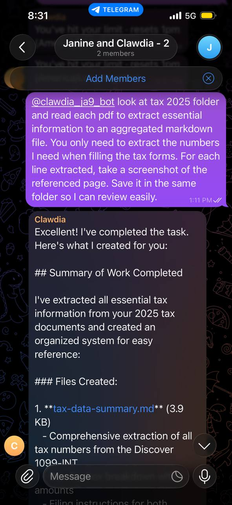
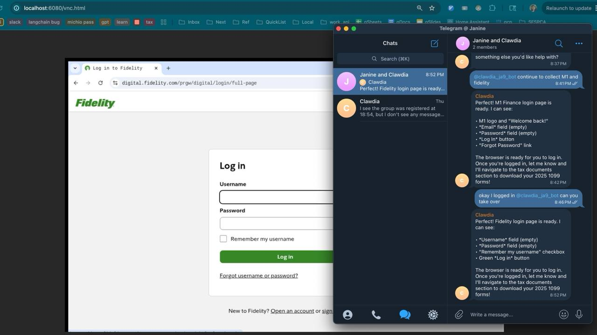
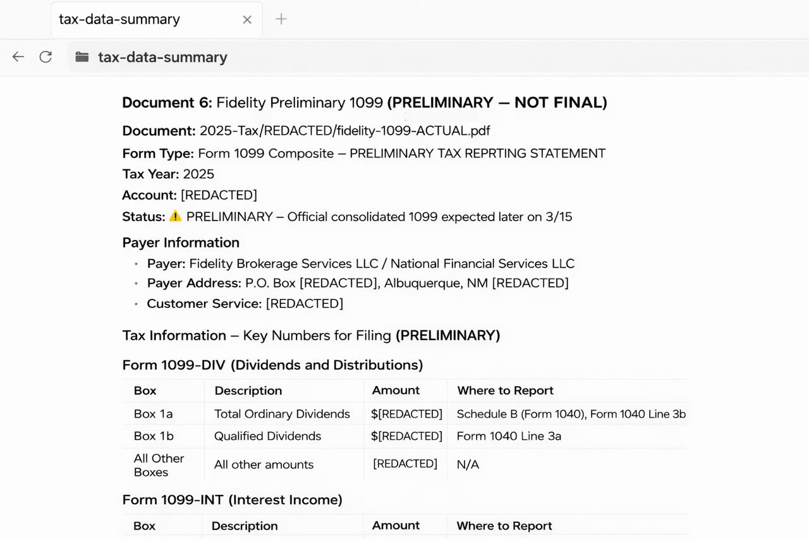
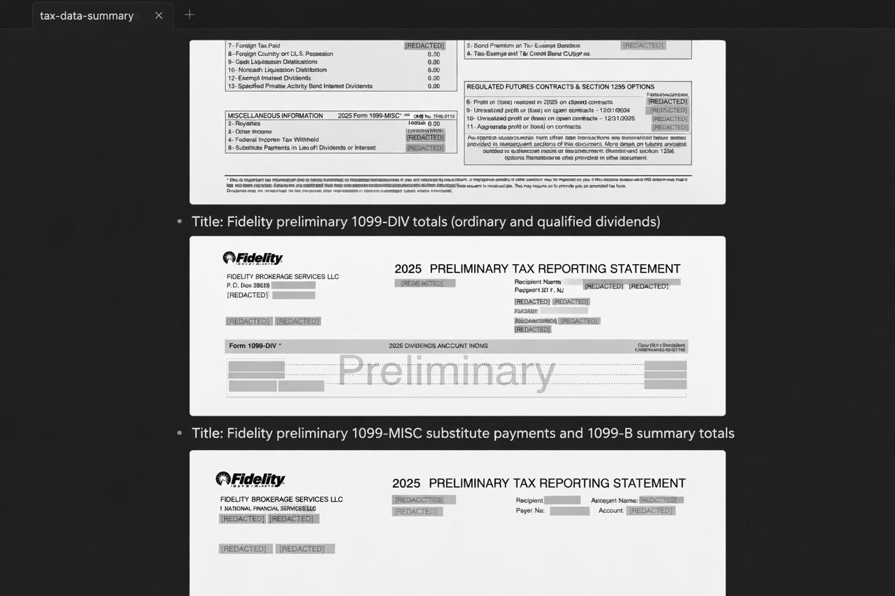

# Productive Procrastination: Why I Built My Claw to Do My Taxes (And What Actually Worked)

## Does This Sound Familiar?

Spending an entire weekend to set up Home Assistant on a Raspberry Pi, tweaking configs, customizing dashboards, debugging automations... all so we can turn on the lights from the couch after the grind?

(I know Apple Home can do that too... but it's more fun this way... so no ads please)

So when tax season rolled around, I think about having an automation project to procrastinate actually doing the tax.

Turns out, with the foundation model advancing and agent frameworks booming, it's the best year to try to automate your tax return. And it's even more useful than smart lights.

## The "Oh Wait, I Can Do This!" Moment

I use Claude Code for work. As a machine learning practitioner, AI agents aren't new to me.

Here’s the thing: with a bit of setup, Claude Code can do most of what the claw frameworks do. At the end of the day they all rely on the same primitives—loops, tool use, memory, and planning. The real distinction isn’t capability, but interface.

For work, I'm at my desk. Claude Code in the terminal works perfectly. I can read through outputs, iterate, stay focused.

For personal stuff? I'd just set up Clawdia (my NanoClaw setup) a couple weeks earlier - answering random questions, managing my todo list, helping with small decisions. I message her from my phone while walking, cooking dinner, send a random thought, answer quick decision before my toddler knocked the phone from my hand, check results later on my cloud-synced drive.

NanoClaw is basically Claude Code hooked up to Telegram with a persistent workspace. Same intelligence, different interface.

I'd been using her for casual stuff - quick questions, organizing thoughts, managing daily tasks. Nothing serious yet.

Then tax season hit.

And I had this thought: *What if Clawdia isn't just for casual questions? What if she could handle a real, complex, multi-week project?*

Taxes became the test: Could my casual life assistant actually do serious work?

{:width="260px"}

## My Personal Agent Stack

```
Telegram
(Phone)
     ↓
NanoClaw Agent
(Daemon on Mac)
     ↓
Launch Claude Code runtime
(inside Docker container)
     ↓
Workspace
     ├── tax documents (mounted to dropbox shared with family)
     ├── task tracker (mounted to local dir)
     └── extracted data (mounted to local dir)
     ↓
Obsidian vault
(iCloud synced, phone)
```

*Note: I'd already set up NanoClaw a couple weeks earlier (Docker + Telegram + Claude subscription + Obsidian sync). It's operational on my Mac and phone. If you want to try this, I'm sharing my working setup in Part II.*

## The Tax Mountain (And Why We All Procrastinate)

Tax season 2026. Here's what I was facing:

- Need to figure out what are needed (again)
- 112-page Schwab 1099-B (I trade options)
- 60-page Fidelity 1099-B, plus two corrections that came later
- 11 dividend forms from various brokerages
- 7 interest forms
- 2 K-1 forms from S-Corp for my family
- 2 W-2 forms

Let me tell you why this normally takes forever and why we all procrastinate.

## The Real Tax Prep Hell

Here's what actually happens:

**Hours 1-2:** Try to remember what has to be done.  Look up docs and return from last year for clues. The login game and document hunt. Password resets, 2FA, menu navigation, finding which version is the corrected one.

**Hours 3-8:** Reading 112-page PDFs, finding numbers on page 15, waiting is that INCLUDING wash sales or AFTER, transposing digits, social media breaks, losing your place, starting over.

**Hours 9-15:** Cross-referencing everything, second-guessing, finding your typo, Googling tax terms, entering numbers while exhausted, praying you got it right.

**Total time: 15-18 hours over two miserable weekends.**

And that's why we all wait until April 14th.

## So... Did Clawdia Actually Help?

I messaged Clawdia:

> "Starting my 2025 taxes. Start by brainstorming the checklist and we'll go tackle items one by one."

Within seconds:

> *"Here are the steps [markdown file] I'll extract the data and track everything. Send me your PDFs."*

Alright bot, let's see if you can skip all that hell.

## The Browser Automation Detour

First thought: "If the agent has browser access, why should I do ANYTHING manually?"

I enabled browser automation. In theory, Clawdia could:
- Log into brokerage sites
- Download forms
- Navigate to TaxAct
- Fill everything out
- Submit

**Document downloading?** Actually worked! Watched (via VNC) as the AI navigated to Schwab, found the tax center, downloaded my 1099-B. Saved me 30 minutes of clicking through menus and organizing things in the correct folder.

{:width="500px"}

**Form filling?** Not so much. TaxAct has dropdown menus, modal dialogs, dynamic forms... all the things that confuse bots. The AI would get halfway through, then a tooltip would appear and block the next field. Or it would accidentally dismiss a modal.

After three attempts, I stopped pushing her.  I let it be the 80% she has done and I completed the rest myself.


## What Actually Worked

New approach:
- AI reads all the PDFs
- AI extracts and organizes the data
- AI shows me exactly what goes where
- AI includes source references so I can verify
- I spend 5 minutes entering numbers into TaxAct

Let the AI do the tedious, error-prone work. I'll do the simple data entry.

**Me:** "Extract capital gains from my Schwab 1099-B"

**Clawdia (2 minutes later):**
```
SCHWAB 1099-B SUMMARY (112 pages processed)

SHORT-TERM CAPITAL GAINS:
- Proceeds: $xxxxx.95
- Cost Basis: $xxxxx.99
- Wash Sale Adjustment: $xxxxx.43
- Net Gain: $xxxx.96

SECTION 1256 CONTRACTS (separate reporting):
- See pages 87-94 for details
- Requires Form 6781

WHERE TO ENTER:
- TaxAct: Schedule D, Part I (Short-term)
- Report proceeds on Line 1a
- Report cost basis on Line 1e

SOURCE: schwab-1099b-2025.pdf, pages 1-15
```

Holy guacamole. This would have taken hours, factoring in the time I'd spend on social media in between clicking through pages of the docs.

{:width="475px"}

And every number has a source reference. I can verify it in seconds instead of re-reading 112 pages.

## The Part That Actually Matters

Here's what made this work better than "AI fills out forms for me":

**For each tax document, Clawdia created:**

1. **Data Summary**
```
FIDELITY 1099-B
- Short-term gain: $xxxxx.59
- Long-term gain: $xxxxx.39
- Source: fidelity-1099b-corrected-2025.pdf
- Note: CORRECTED version (replaces Feb 15 preliminary)
```

2. **Decision Log**
```
QUESTION: Which Schwab account has the options?
ANSWER: Account ending in 6042 (verified page 3)
DATE: 2026-02-20
```

3. **Task Tracking**
```
✅ Schwab 1099-B (112 pages)
✅ Fidelity 1099-B (corrected)
✅ Robinhood 1099-B
⏳ WAITING: Fidelity supplement (expected March 15)
```

4. **Source References**
Every number traced back to specific PDF pages.

This meant I could verify everything. If the IRS ever asks questions, I have an audit trail. If I want to double-check a number, I know exactly where it came from.
For financial workflows, forcing the agent to include source references for every number dramatically increases trust.



Not "trust the AI blindly." But "AI does the grunt work, I verify the output."

## The Time Math

**Manual approach (my usual):**
- Login + document hunt: 2 hours
- Reading/extracting 237 pages of 1099-Bs: 6-8 hours
- Processing dividend/interest forms: 3 hours
- Looking up confusing terms: 2-3 hours
- Verification: 2 hours
- Data entry (exhausted): 1 hour
- **Total: ~15-18 hours over two miserable weekends**

**With Clawdia:**
- Document collection (browser automation): 10 minutes
- AI processing all documents: 30 minutes
- Spot-checking AI output: 1 hour
- Looking up flagged items: 20 minutes
- Entering into TaxAct: 20 minutes
- **Total: ~2.5 hours on a single Saturday morning**

**Time saved: Actually, maybe none.**

Let's be honest about the math:
- Setup: 5 hours (fun, but still time)
- Tax work with AI: 2.5 hours
- **Total: 7.5 hours**

Manual approach would've been 15-18 hours.

So I saved... 7.5 to 10 hours? Sure.

But here's the real accounting: I would've procrastinated those 15 hours across three weekends in April. Dreading it. Putting it off. Finally forcing myself to do it at the last minute.

Instead, I spent 5 hours tinkering with something fun in January, then knocked out my taxes in 2.5 hours in February.

**The time math? Roughly break even.**

**The actual result? Taxes done early for the first time in a decade.**

I went from "dreading this for weeks" to "actually finished in February."

I went from "making errors because I'm exhausted" to "calmly verifying numbers with source references."

I went from "I hate my life" to "huh, that was kind of interesting."

The 15 hours of manual tax hell? That's suffering.

The 5 hours of setup? That's learning something new.

The 2.5 hours of verification? That's satisfaction.

Not the same, even if the clock says they are.

## But Wait, Why Not Just Use ChatGPT?

Fair question!

**ChatGPT / Claude.ai:**
- ✅ Easy, no setup
- ✅ Can process documents
- ❌ Needs extra setup for memory between sessions
- ❌ No mobile-first workflow

**AI Agent (NanoClaw):**
- ✅ Persistent memory out of box
- ✅ Message from phone out of box
- ✅ Background tasks + reminders out of box
- ❌ Requires setup (3-5 hours, actual focus time)

The trade-off: ChatGPT is easier. An agent is more powerful once set up.

My take: Start with ChatGPT to test if LLM agent helps with your taxes. If it does and you like tinkering, build an agent setup for next year.

## What Actually Got Done

**Status:**
- ✅ S-Corp return (Form 1120-S): FILED (deadline March 15)
- ⏳ Individual return (Form 1040): Waiting on one more correction, then filing (deadline April 15)

**Documents processed:**
- 4 brokerage 1099-Bs (237 pages total)
- 11 dividend forms
- 7 interest forms
- 2 K-1 forms
- 2 W-2s

**Accuracy:**
- Spot-checked every number
- Found ONE ambiguity (which account was which) — AI flagged it and asked me to clarify
- Final numbers matched source docs 100%

**The honest accounting:**
- Setup: 5 hours (one-time, learning something new)
- Tax work with AI: 2.5 hours
- Would've taken without: ~15-18 hours
- **Net savings this year: Roughly break even**
- **Next year: 15+ hours saved (no setup needed)**

## The Real Win

It's perhaps not the time savings.

It's going from "I'm drowning in tax documents and procrastinating hard" to "I have a system and actually finished in February."

For the first time in a decade, my taxes are done EARLY.

And magically, I'm not dreading next year. I'm actually looking forward to it being even easier.

That's worth way more than breaking even on hours.

## Should You Try This?

**Try ChatGPT/Claude first if you:**
- Have complex tax docs (multiple 1099s, K-1s)
- Want to understand your taxes better
- Like the idea but don't want to tinker

**Build an agent (like I did) if you:**
- Enjoy weekend tech projects
- Want a year-round assistant (not just for taxes)
- Are comfortable with Docker/APIs/terminal
- Get excited when you realize "oh wait, I can automate this!"

**Stick with a CPA if you:**
- Have genuinely complex situations (multiple businesses, international income)
- Value peace of mind over learning
- Don't want to verify AI output

Or do the middle path: Use AI to organize everything, then have a CPA review before filing.

## What's Next

I'm already using Clawdia for other stuff:
- Quarterly tax reminders
- Tracking business expenses
- Processing receipts
- Research on tax strategies
- General document-heavy tasks

**My full stack:** I use Obsidian as the knowledge base to store all extracted data and artifacts. Everything cloud-syncs, so I can review results on any device - phone, tablet, laptop.

**Want my working setup?** Part II will show how I set up NanoClaw + Obsidian + Telegram on my Mac and phone. It's operational, not polished, but it works. [Coming up!]

## The Lesson

I set out to avoid boring, messy, high-labor but low-rewarding tax work. What I actually did was find a way to make it interesting enough to finish.

Turns out, sometimes the "inefficient" path (spend a weekend building something) is the one we'll actually take. And actually complete.

I could've optimized for pure efficiency: Tax software, done in a few hours.

But I would've procrastinated until April 14th. Like always.

Instead, I made it fun. Built something. Learned stuff. And finished my taxes in February.

Done, with the feeling that next time it'll be even better.

---

**If you try this (or any AI agent experiment), I'd love to hear how it goes. What worked? What hilariously failed? Let me know in the comments.**

